Below is the **complete Advanced Track README for FinResearch AI**, written in the *exact same structure, tone, and progression* as the attached **ScholarAI advanced README**  — but fully adapted to the **multi-agent financial research system** described in your architecture diagram.

Mermaid flowcharts **are included** as you requested.

---

# 🔴 Advanced Track — FinResearch AI

Welcome to the **Advanced Track** of the **FinResearch AI** project!
This track is built for participants who want to create a **production-grade, multi-agent financial research system** capable of autonomously gathering data, analyzing ratios, extracting insights, and generating polished investor-style reports.

In this track, you will:

* Build **specialized financial research agents** with dedicated roles
* Implement **multi-agent orchestration** using a Manager Agent
* Use a **Shared Vector Memory** for storing retrieved context
* Integrate **financial market APIs** + **news/search APIs**
* Deploy a **Gradio interface** that displays a full financial report

By the end, you'll have a functioning multi-agent workflow similar to real-world financial research assistants used in fintech, hedge funds, and analytics teams.

---

# 🧠 Agent Workflow

Below is the multi-agent system architecture as a **Mermaid diagram** (GitHub compatible).

```mermaid
flowchart TD
    User([👤 User Input]) --> Manager([🎯 Manager Agent])
    Manager --> Researcher([🔍 Researcher Agent])
    Manager --> Analyst([📊 Financial Analyst Agent])
    Manager --> Reporter([📝 Reporting Agent])
    
    Researcher --> SearchAPI([🌐 Search APIs])
    Analyst --> DataAPI([📈 Market Data APIs])
    Reporter --> Report([📤 Final Report])
    
    Memory[(💾 Shared Vector Memory)] -.-> Manager
    Memory -.-> Researcher
    Memory -.-> Analyst
    Memory -.-> Reporter
    
    style User fill:#5e81ac,stroke:#2e3440,stroke-width:2px,color:#eceff4
    style Manager fill:#88c0d0,stroke:#2e3440,stroke-width:3px,color:#2e3440
    style Researcher fill:#d08770,stroke:#2e3440,stroke-width:2px,color:#2e3440
    style Analyst fill:#d08770,stroke:#2e3440,stroke-width:2px,color:#2e3440
    style Reporter fill:#d08770,stroke:#2e3440,stroke-width:2px,color:#2e3440
    style SearchAPI fill:#5e81ac,stroke:#2e3440,stroke-width:2px,color:#eceff4
    style DataAPI fill:#5e81ac,stroke:#2e3440,stroke-width:2px,color:#eceff4
    style Report fill:#a3be8c,stroke:#2e3440,stroke-width:2px,color:#2e3440
    style Memory fill:#b48ead,stroke:#2e3440,stroke-width:2px,color:#eceff4
```

---

# 🎓 Weekly Breakdown

## ✅ Week 1: Multi-Agent Setup & Core Capabilities

### 1. Project Initialization

* Setup environment, repo, `requirements.txt`
* Add `.env` with:

  * `OPENAI_API_KEY`
  * `TAVILY_API_KEY` or `SERPAPI_API_KEY`
  * One financial API key:

    * `ALPHAVANTAGE_API_KEY`, `FMP_API_KEY`, or use `yfinance` (no key)

### 2. Build the Specialized Worker Agents

### **Researcher Agent — Web & News Scraper**

Responsibilities:

* Fetch recent market news
* Search the web for sentiment, risks, upcoming events
* Extract article text snippets
* Write brief summaries
* Store results in vector DB

### **Financial Analyst Agent — Quant & Ratios**

Responsibilities:

* Fetch real financial data
* Compute:

  * Price trends (1D, 1W, 1M, 1Y)
  * Volatility indicators
  * P/E, PEG, Debt/Equity
  * Revenue/EPS growth
  * Risk flags (LLM-estimated)

All findings must be added to **Shared Memory**.

### 3. Implement Shared Memory (Vector DB)

Use ChromaDB or FAISS to store:

* News snippets
* Financial analyses
* Ratio breakdowns
* Extracted fundamentals

### 4. Begin Manager Agent Implementation

The manager:

* Receives user query
* Delegates tasks to each agent
* Ensures all agents complete cleanly
* Performs initial quality control

By end of Week 1 you should have:

* All worker agents functional
* Shared memory writing working
* Manager Agent calling each worker sequentially

---

## ✅ Week 2: Multi-Agent Orchestration & Report Generation

### 1. Complete the Manager Agent Logic

Manager Agent should:

* Route the user request
* Call Researcher → Analyst → Reporting Agent
* Combine outputs
* Ensure consistency
* Run a light “sanity check” on numbers

### 2. Build Reporting Agent — Synthesis & Formatting

This is the "final write-up" agent.

It should produce a structured report:

### **Financial Report Structure**

1. **Executive Summary (≤150 words)**
2. **Company Snapshot**

   * Sector, market position, competitors
3. **Key Financial Indicators**

   * Price movements
   * Valuation ratios
   * Profitability ratios
4. **Recent News & Sentiment**
5. **Opportunities (Bull Case)**
6. **Risks (Bear Case)**
7. **Final Perspective**

### 3. Add Formatting Output

Reporting Agent must export:

* markdown
* json

### 4. Improve Orchestration Pattern

Add:

* Parallel execution of Researcher + Analyst
* Context retrieval from Vector DB
* Optional **Critic Agent** to:

  * Validate numerical consistency
  * Check outdated or conflicting news
  * Flag hallucinations

---

## ✅ Week 3: Deployment & Finalization

### 1. Build the Gradio UI

UI should display:

**Inputs:**

* Ticker (AAPL, TSLA)
* Optional: "Investor Mode" (Neutral / Bullish / Bearish tone)

**Outputs (Tabs):**

* Executive Summary
* Financial Indicators
* News & Sentiment
* Risks & Opportunities
* Full Report (Markdown)

### 2. Export Options

Buttons:

* **Download Markdown Report**
* **Download JSON Report**

### 3. Deployment

Deploy to:

* Hugging Face Spaces **or**
* Streamlit Cloud

### 4. Polishing

* Self-consistency loops
* Minor re-ranking of news
* Highlight risk factors more clearly
* Add disclaimers (LLM-based financial analysis is non-advisory)

---

# 🗒️ Project Timeline Overview

| Phase                             | Beginner Track                 | Advanced Track                               |
| --------------------------------- | ------------------------------ | -------------------------------------------- |
| **Week 1: Setup + Foundations**   | Repo setup, APIs, single agent | Multi-agent architecture, embeddings, memory |
| **Week 2: Research + Analysis**   | Fetch news + market data       | Researcher + Analyst agents implemented      |
| **Week 3: Synthesis + Reporting** | Basic report generation        | Reporting Agent + Manager orchestration      |
| **Week 4: UI + Deployment**       | Gradio/Streamlit app           | Full multi-agent pipeline deployment         |

---

# 📃 Report Template

Use `advanced/REPORT.md` to document:

* Agent roles & responsibilities
* Architecture diagram (screenshot or Mermaid)
* Example intermediate outputs
* Final report samples
* Notes on accuracy, challenges, and consistency fixes
* Screenshots of deployed UI

---

# 🚪 Where to Submit

Submit your work in:

* `advanced/submissions/team-members/<your-name>/`
* `advanced/submissions/community-contributions/<your-name>/`

See **CONTRIBUTING.md** for full submission rules.
