# FinResearch AI - Advanced Track Project Report

**Author:** Art Turner
**Project:** Multi-Agent Financial Research System
**Track:** Advanced
**Date:** December 2, 2025

---

## Executive Summary

This project implements a production-grade, multi-agent financial research system capable of autonomously gathering data, analyzing financial ratios, extracting insights, and generating polished investor-style reports. The system uses specialized AI agents that collaborate through shared vector memory to provide comprehensive financial analysis.

---

## System Architecture

### Architecture Diagram

```mermaid
flowchart TD
    User([👤 User Input]) --> Manager([🎯 Manager Agent])
    Manager --> Researcher([🔍 Researcher Agent])
    Manager --> Analyst([📊 Financial Analyst Agent])
    Manager --> Reporter([📝 Reporting Agent])

    Researcher --> SearchAPI([🌐 Search APIs])
    Analyst --> DataAPI([📈 Market Data APIs])
    Reporter --> Report([📤 Final Report])

    Memory[(💾 Shared Vector Memory)] -.-> Manager
    Memory -.-> Researcher
    Memory -.-> Analyst
    Memory -.-> Reporter

    style User fill:#5e81ac,stroke:#2e3440,stroke-width:2px,color:#eceff4
    style Manager fill:#88c0d0,stroke:#2e3440,stroke-width:3px,color:#2e3440
    style Researcher fill:#d08770,stroke:#2e3440,stroke-width:2px,color:#2e3440
    style Analyst fill:#d08770,stroke:#2e3440,stroke-width:2px,color:#2e3440
    style Reporter fill:#d08770,stroke:#2e3440,stroke-width:2px,color:#2e3440
    style SearchAPI fill:#5e81ac,stroke:#2e3440,stroke-width:2px,color:#eceff4
    style DataAPI fill:#5e81ac,stroke:#2e3440,stroke-width:2px,color:#eceff4
    style Report fill:#a3be8c,stroke:#2e3440,stroke-width:2px,color:#2e3440
    style Memory fill:#b48ead,stroke:#2e3440,stroke-width:2px,color:#eceff4
```



### Data Flow

1. **User Input** → Manager Agent receives ticker and preferences
2. **Parallel Execution** → Researcher and Analyst agents work simultaneously
3. **Vector Memory Storage** → All findings are stored in ChromaDB
4. **Report Generation** → Reporting Agent synthesizes all findings
5. **Output** → Comprehensive markdown/JSON reports delivered to user

---

## Agent Roles & Responsibilities

### 1. Manager Agent (`manager_agent.py`)

**Role:** Orchestrator and coordinator

**Responsibilities:**
- Validates ticker symbols before processing
- Coordinates workflow between all worker agents
- Manages parallel/sequential execution
- Performs quality control checks
- Validates final report completeness
- Handles error recovery

**Key Methods:**
- `conduct_research()` - Main orchestration method
- `_validate_ticker()` - Ensures ticker is valid
- `_execute_parallel_research()` - Runs agents in parallel
- `_quality_control()` - Validates agent outputs

**Example Output:**
```
[ManagerAgent] Starting research workflow for AAPL
[ManagerAgent] Investor Mode: neutral
[ManagerAgent] Parallel Execution: True
[ManagerAgent] Validating ticker AAPL...
[ManagerAgent] Ticker AAPL validated successfully
[ManagerAgent] Executing parallel research for AAPL...
[ManagerAgent] Research workflow completed successfully for AAPL
```

---

### 2. Researcher Agent (`researcher_agent.py`)

**Role:** Web & News Intelligence Gatherer

**Responsibilities:**
- Fetches recent market news using search APIs
- Analyzes sentiment from news articles
- Identifies risks and opportunities
- Extracts article snippets and summaries
- Stores findings in vector memory

**APIs Used:**
- Tavily API (primary) for web search
- SerpAPI (fallback) for news search
- yfinance news (fallback) if no API keys

**Key Methods:**
- `research()` - Main research orchestration
- `_gather_news()` - Fetches news articles
- `_analyze_sentiment()` - LLM-based sentiment analysis
- `_identify_risks()` - Extracts risks and opportunities

**Example Intermediate Output:**
```
Research Summary for AAPL:
- Found 10 recent news articles
- Overall Sentiment: BULLISH (Score: 7)
- Identified 4 risks and 5 opportunities

SENTIMENT EXPLANATION:
Recent product launches and strong quarterly earnings have driven
positive sentiment. Analysts remain optimistic about AI integration
and services revenue growth.

RISKS:
- Regulatory scrutiny in EU markets
- Supply chain dependencies in Asia
- Competition in smartphone market
- Premium pricing pressure

OPPORTUNITIES:
- AI and machine learning integration
- Expanding services ecosystem
- Wearables market growth
- Emerging markets penetration
- Vision Pro adoption potential
```

---

### 3. Financial Analyst Agent (`analyst_agent.py`)

**Role:** Quantitative Analysis & Metrics

**Responsibilities:**
- Fetches comprehensive stock data
- Computes valuation metrics (P/E, PEG, P/B)
- Analyzes financial health (D/E, Current Ratio, ROE)
- Calculates growth metrics
- Assesses risk indicators (volatility, beta)
- Generates LLM-based financial insights

**Data Sources:**
- yfinance (primary, free)
- Alpha Vantage (optional)
- Financial Modeling Prep (optional)

**Key Methods:**
- `analyze()` - Main analysis orchestration
- `_analyze_valuation()` - Valuation metrics
- `_analyze_financial_health()` - Balance sheet analysis
- `_analyze_growth()` - Growth trajectory
- `_analyze_risk_indicators()` - Risk assessment

**Example Intermediate Output:**
```
Financial Analysis Summary for AAPL:
- Current Price: $185.23
- Valuation: Fairly Valued (P/E: 29.45)
- Financial Health: Strong liquidity, Conservative leverage
- Growth: Moderate growth
- Risk Level: Low (Low volatility (Stable))

VALUATION ANALYSIS:
Stock appears fairly valued with P/E of 29.45.
Potentially undervalued relative to growth (PEG: 0.85).

FINANCIAL HEALTH:
Financial health is strong with conservative (low leverage).
Debt/Equity: 1.73, Current Ratio: 1.05, ROE: 147.3%

RISK ANALYSIS:
Risk level is Low with low volatility (stable) and
market-correlated characteristics. Annualized volatility: 18.2%
```

---

### 4. Reporting Agent (`reporting_agent.py`)

**Role:** Report Synthesis & Formatting

**Responsibilities:**
- Retrieves context from vector memory
- Generates executive summary (≤150 words)
- Creates company snapshot
- Formats financial indicators
- Synthesizes news and sentiment
- Develops bull case (opportunities)
- Develops bear case (risks)
- Provides final balanced perspective

**Report Sections:**
1. Executive Summary
2. Company Snapshot
3. Key Financial Indicators
4. Recent News & Sentiment
5. Opportunities (Bull Case)
6. Risks (Bear Case)
7. Final Perspective

**Key Methods:**
- `generate_report()` - Main report generation
- `_generate_executive_summary()` - Concise overview
- `_generate_bull_case()` - Opportunities analysis
- `_generate_bear_case()` - Risk analysis
- `export_report()` - Format conversion

**Example Report Structure:**
```markdown
# Financial Research Report: AAPL

**Generated:** 2025-12-02 14:30:00

## Executive Summary
Apple Inc. (AAPL) continues to demonstrate strong market position...
[≤150 words]

## Company Snapshot
**Company:** Apple Inc.
**Sector:** Technology
**Market Cap:** $2,850,000,000,000
...

## Key Financial Indicators
### Price Performance
- 1 Year: +42.35%
...

[Additional sections...]
```

---

## Shared Vector Memory Implementation

### Technology: ChromaDB

**Purpose:** Persistent storage for agent findings with semantic search capabilities

**Configuration:**
- **Path:** `./chroma_db/`
- **Collection:** `financial_research`
- **Embedding:** Automatic (ChromaDB default)

**Data Structure:**
```python
{
    'content': 'Text content of finding',
    'metadata': {
        'ticker': 'AAPL',
        'agent': 'ResearcherAgent',
        'type': 'sentiment_analysis',
        'timestamp': '2025-12-02T14:30:00',
        # Additional type-specific metadata
    }
}
```

**Key Operations:**
- `add_document()` - Store individual findings
- `add_batch()` - Batch storage for efficiency
- `query()` - Semantic search across findings
- `get_by_ticker()` - Retrieve all data for a stock
- `get_by_agent()` - Retrieve agent-specific data
- `get_context()` - Formatted context for LLM prompts

**Benefits:**
- Enables context sharing between agents
- Supports semantic search for relevant information
- Provides persistence across sessions
- Allows for historical analysis

---

## API Integrations

### Financial Data APIs

**Primary: yfinance (Free)**
- Real-time stock prices
- Financial ratios and metrics
- Historical price data
- Company information
- News feed

**Optional: Alpha Vantage**
- Enhanced fundamental data
- Advanced technical indicators
- Requires API key

**Optional: Financial Modeling Prep**
- Institutional-grade financial data
- Detailed financial statements
- Requires API key

### Search APIs

**Primary: Tavily API**
- Advanced web search
- News aggregation
- Content extraction
- Requires API key

**Fallback: SerpAPI**
- Google News search
- Web scraping
- Requires API key

**Fallback: yfinance News**
- Built-in news feed
- No API key required
- Limited coverage

### LLM API

**OpenAI GPT-4**
- Sentiment analysis
- Risk identification
- Report synthesis
- Insight generation

---

## Example Workflows

### 1. Neutral Analysis (Default)

**Input:** `AAPL`, Mode: `Neutral`

**Process:**
1. Manager validates AAPL ticker
2. Researcher + Analyst run in parallel
3. Researcher fetches 10 news articles, analyzes sentiment
4. Analyst computes 20+ financial metrics
5. Both store findings in vector memory
6. Reporter retrieves context and generates balanced report
7. Quality control validates completeness
8. Report delivered to user

**Execution Time:** ~45-60 seconds

---

### 2. Bullish Analysis

**Input:** `TSLA`, Mode: `Bullish`

**Process:**
- Same workflow as neutral
- Reporting agent emphasizes:
  - Growth opportunities
  - Positive catalysts
  - Competitive advantages
  - Upside potential

**Tone:** Optimistic but still includes risks

---

### 3. Bearish Analysis

**Input:** `GME`, Mode: `Bearish`

**Process:**
- Same workflow as neutral
- Reporting agent emphasizes:
  - Risk factors
  - Competitive threats
  - Financial concerns
  - Downside scenarios

**Tone:** Cautious but still includes opportunities

---

## Quality Control & Validation

### Manager Agent Quality Checks

1. **Ticker Validation**
   - Verifies ticker exists
   - Checks data availability
   - Validates company name

2. **Agent Output Validation**
   - Ensures no critical errors
   - Checks data completeness
   - Verifies required fields

3. **Vector Memory Verification**
   - Confirms data storage
   - Validates metadata
   - Checks document count

4. **Report Validation**
   - Ensures all sections present
   - Checks for errors
   - Validates structure

### Error Handling

- Graceful degradation on API failures
- Fallback data sources
- Clear error messages to user
- Partial results when possible

---

## Challenges & Solutions

### Challenge 1: API Rate Limits

**Problem:** Free APIs have rate limits and may be slow

**Solution:**
- Implemented multiple fallback options
- Used yfinance as reliable free source
- Cached data in vector memory
- Parallel execution for speed

### Challenge 2: Data Consistency

**Problem:** Different data sources may have conflicting information

**Solution:**
- Prioritized primary data sources
- Implemented quality control checks
- LLM-based consistency validation
- Clear data source attribution

### Challenge 3: LLM Hallucinations

**Problem:** LLMs may generate inaccurate financial data

**Solution:**
- Grounded all analysis in retrieved data
- Separated facts from interpretations
- Quality control validation
- Disclaimers in all reports

### Challenge 4: Processing Time

**Problem:** Sequential execution was too slow

**Solution:**
- Implemented parallel agent execution
- Used ThreadPoolExecutor for concurrency
- Optimized API calls
- Batch operations for vector storage

---

## Performance Metrics

### Typical Execution Times

- **Ticker Validation:** 1-2 seconds
- **Researcher Agent:** 15-25 seconds
- **Financial Analyst Agent:** 10-20 seconds
- **Parallel Execution (both):** 20-30 seconds
- **Report Generation:** 15-25 seconds
- **Total Workflow:** 45-70 seconds

### Data Metrics

- **News Articles:** 5-10 per query
- **Financial Metrics:** 20+ ratios and indicators
- **Vector Store Documents:** 10-15 per analysis
- **Report Length:** 1,500-2,500 words

---

## Accuracy & Limitations

### Strengths

✅ Real-time financial data from reliable sources
✅ Comprehensive multi-dimensional analysis
✅ Context-aware through vector memory
✅ Professional report structure
✅ Multiple data source fallbacks

### Limitations

⚠️ **Not Financial Advice:** AI-generated analysis for informational purposes only
⚠️ **Data Delays:** Free APIs may have 15-minute delays
⚠️ **Limited Historical Data:** Focus on recent information
⚠️ **LLM Interpretation:** Subjective analysis from AI models
⚠️ **API Dependencies:** Requires internet connection and API availability

### Accuracy Notes

- Financial metrics are sourced directly from APIs (high accuracy)
- Sentiment analysis is LLM-based (subjective interpretation)
- News coverage depends on ticker popularity
- Small-cap stocks may have limited data

---

## Future Enhancements

### Planned Improvements

1. **Critic Agent**
   - Validates numerical consistency
   - Checks for outdated information
   - Flags potential hallucinations

2. **Technical Analysis**
   - Chart patterns
   - Moving averages
   - RSI, MACD indicators

3. **Peer Comparison**
   - Industry benchmarking
   - Competitor analysis
   - Relative valuation

4. **Historical Tracking**
   - Track predictions over time
   - Accuracy metrics
   - Model improvements

5. **Advanced Orchestration**
   - LangGraph integration
   - Conditional workflows
   - Adaptive agent selection

---

## Deployment

### Local Development

```bash
# Clone repository
git clone [repository-url]
cd art-turner

# Create virtual environment
python -m venv venv
source venv/bin/activate  # On Windows: venv\Scripts\activate

# Install dependencies
pip install -r requirements.txt

# Configure environment
cp .env.example .env
# Edit .env with your API keys

# Run application
python app.py
```

### Hugging Face Spaces

1. Create new Space
2. Upload all files
3. Add secrets (API keys) in Settings
4. Set Python version to 3.10+
5. App will auto-deploy

### Streamlit Cloud

1. Push to GitHub repository
2. Connect to Streamlit Cloud
3. Add secrets via Streamlit dashboard
4. Deploy

---

## Technologies Used

### Core Framework
- **Python 3.10+**
- **LangChain** - Agent framework
- **OpenAI GPT-4** - LLM for analysis

### Data & Search
- **yfinance** - Financial data
- **Tavily/SerpAPI** - Web search
- **ChromaDB** - Vector database

### UI & Deployment
- **Gradio** - Web interface
- **python-dotenv** - Environment management

### Data Processing
- **pandas** - Data manipulation
- **numpy** - Numerical operations

---

## Conclusion

This multi-agent financial research system demonstrates the power of specialized AI agents working collaboratively. By dividing responsibilities and sharing context through vector memory, the system provides comprehensive, multi-dimensional financial analysis that rivals manual research processes.

The architecture is modular, scalable, and production-ready, with robust error handling, quality control, and clear separation of concerns. The system successfully achieves all requirements of the Advanced Track while maintaining code quality and user experience.

---

## Appendix: File Structure

```
art-turner/
├── agents/
│   ├── __init__.py
│   ├── manager_agent.py          # Orchestration
│   ├── researcher_agent.py       # News & sentiment
│   ├── analyst_agent.py          # Financial analysis
│   └── reporting_agent.py        # Report generation
├── memory/
│   ├── __init__.py
│   └── vector_store.py           # ChromaDB wrapper
├── utils/
│   ├── __init__.py
│   ├── api_clients.py            # API integrations
│   └── formatters.py             # Data formatting
├── config/
│   ├── __init__.py
│   └── settings.py               # Configuration
├── app.py                        # Gradio UI
├── requirements.txt              # Dependencies
├── .env.example                  # Environment template
├── .gitignore                    # Git ignore rules
├── README.md                     # Project README
└── REPORT.md                     # This file

Total Lines of Code: ~2,500
Total Files: 15
```

---

**Project Status:** ✅ Complete and Functional

**Author:** Art Turner
**Date:** December 2, 2025
**Track:** Advanced - FinResearch AI
