# 🟢 Beginner Track — FinResearch AI (Market Research → Financial Summary)

Welcome to the **Beginner Track** of the **FinResearch AI** project!
In this track, you’ll build a simple but powerful **single-agent financial research assistant** that:

* Fetches **market data** from financial APIs (Yahoo Finance, Alpha Vantage, or FMP),
* Retrieves **recent news** using Tavily or SerpAPI,
* Processes everything through an **OpenAI-powered Research Agent**, and
* Outputs a clean, structured **financial summary report** through a **Gradio** UI.

Beginner-friendly — but you will still learn API integration, prompt craft, structured outputs, and deployment.

---

## Agent Workflow

```mermaid
flowchart LR
    Start([👤 User Input]) --> Agent([🔍 Market Research Agent])
    Agent --> End([📤 Synthesized Report])
    
    style Start fill:#5e81ac,stroke:#2e3440,stroke-width:2px,color:#eceff4
    style Agent fill:#d08770,stroke:#2e3440,stroke-width:2px,color:#2e3440
    style End fill:#5e81ac,stroke:#2e3440,stroke-width:2px,color:#eceff4
```

---

# 🎓 Weekly Breakdown

## ✅ Week 1: Environment Setup & Data Retrieval

### 🔧 Setup

* Create repo, virtual environment, and `requirements.txt`
* Add `.env` with:

  * `OPENAI_API_KEY`
  * **One** of:

    * `TAVILY_API_KEY` or `SERPAPI_API_KEY`
  * **One** of:

    * `ALPHAVANTAGE_API_KEY`, or
    * `FMP_API_KEY` *(optional)*

### 🔍 Implement API Tools

Build lightweight wrappers:

**1. Market Data Tool**
Example features to fetch:

* Current price
* Market cap
* P/E, EPS, Beta
* 1Y/5Y price movements
* Revenue / Net Income trends (optional)

**2. News Search Tool**

* Queries Tavily/SerpAPI
* Return `{title, url, snippet, relevance}`

### 🧠 Build the Research Agent

A single OpenAI Agent that:

* Accepts a ticker (e.g., *AAPL*, *TSLA*) or company name
* Calls:

  * `get_market_data(symbol)`
  * `get_company_news(symbol)`
* Returns **clean, structured intermediate results**

Goal: data retrieval + minor interpretation
—not full financial synthesis yet.

---

## ✅ Week 2: Financial Summary & Structured Output

### 🧩 Add Analysis + Synthesis Logic

Enhance the agent output with a structured **Financial Summary Schema**, including:

**1. Company Overview**

* Name
* Sector
* Market position

**2. Market Snapshot**

* Price
* Market cap
* Volume
* Key ratios

**3. Performance Signals**

* Recent price trend
* Volatility
* Revenue/EPS trends (optional)

**4. News Summary**

* Top 3–5 headlines
* Sentiment (LLM-based classification)
* Impact rating (LLM estimate)

**5. Final Takeaways**

* Opportunities
* Risks
* Neutral/uncertain factors

### 📦 Add Exporters

* `to_markdown(report_obj)` → `report.md`
* `to_json(report_obj)` → `report.json`

---

## ✅ Week 3: Build the UI & Deploy

### 🖥 Build Gradio App

Features:

* Company/Ticker input box
* Live generated financial summary
* Tabs:

  * **Overview**
  * **Performance**
  * **News**
  * **Risks & Opportunities**
* Buttons:

  * **Download Markdown**
  * **Download JSON**

### 🚀 Deployment

You may deploy to either:

* **Hugging Face Spaces**, or
* **Streamlit Cloud**

### Final Deliverables

* `app.py`
* Deployed web app link

---

# 📅 Project Timeline Overview

| Phase                             | Beginner Track                 | Advanced Track                               |
| --------------------------------- | ------------------------------ | -------------------------------------------- |
| **Week 1: Setup + Foundations**   | Repo setup, APIs, single agent | Multi-agent architecture, embeddings, memory |
| **Week 2: Research + Analysis**   | Fetch news + market data       | Researcher + Analyst agents implemented      |
| **Week 3: Synthesis + Reporting** | Basic report generation        | Reporting Agent + Manager orchestration      |
| **Week 4: UI + Deployment**       | Gradio/Streamlit app           | Full multi-agent pipeline deployment         |

---

# 🚪 Where to Submit Your Work

Place your work in:

* `beginner/submissions/team-members/<your-name>/`
* `beginner/submissions/community-contributions/<your-name>/`

See **CONTRIBUTING.md** for exact submission rules.

